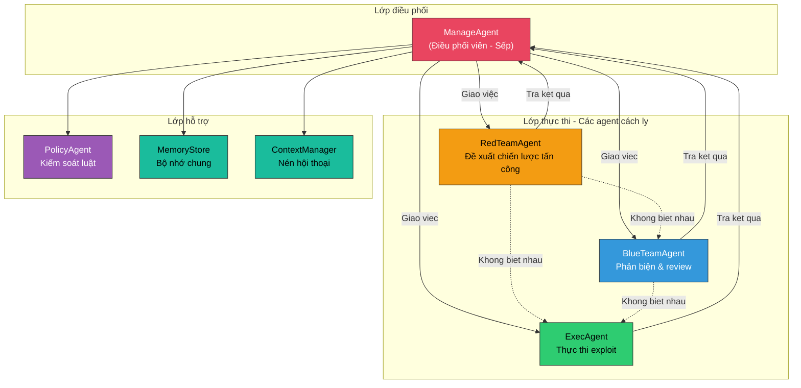
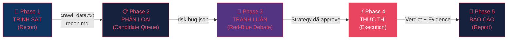
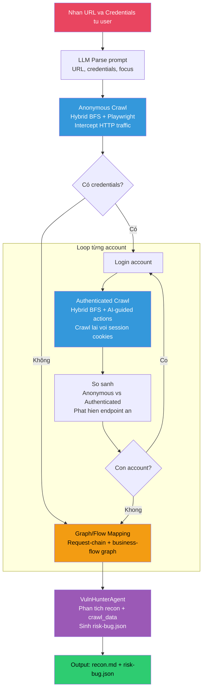
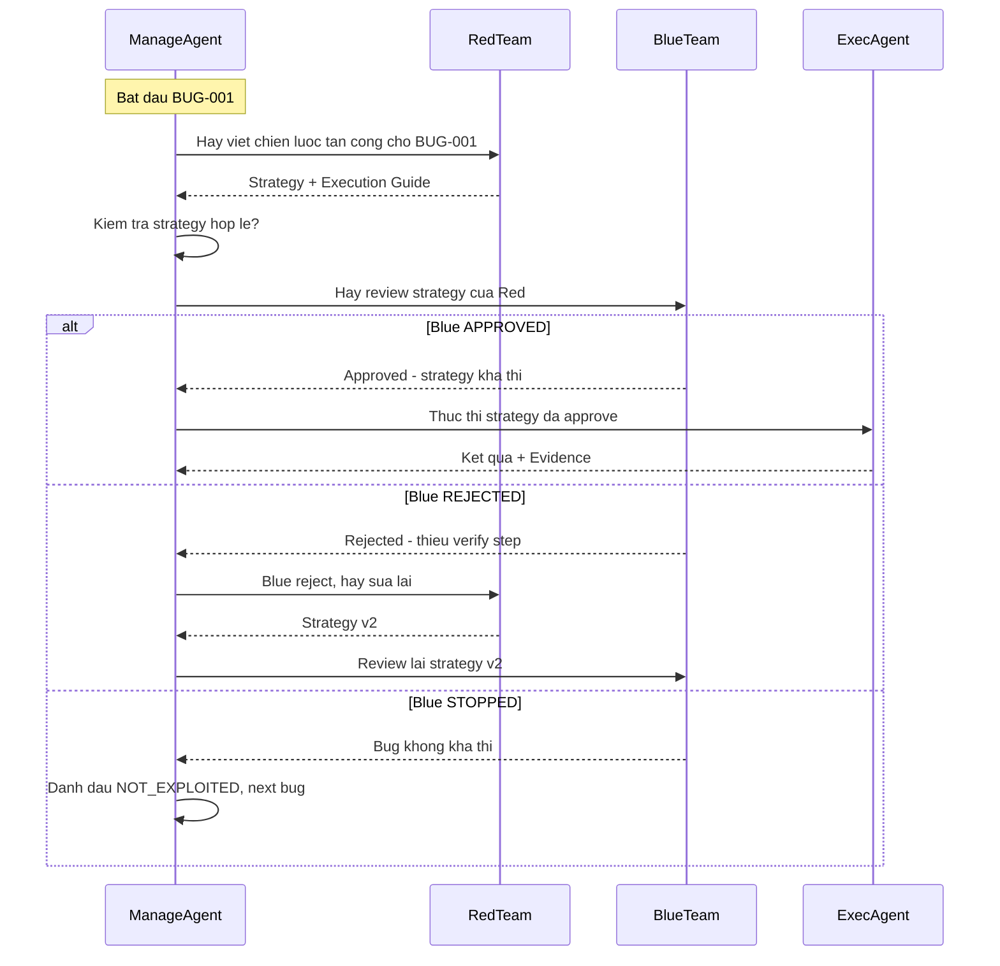
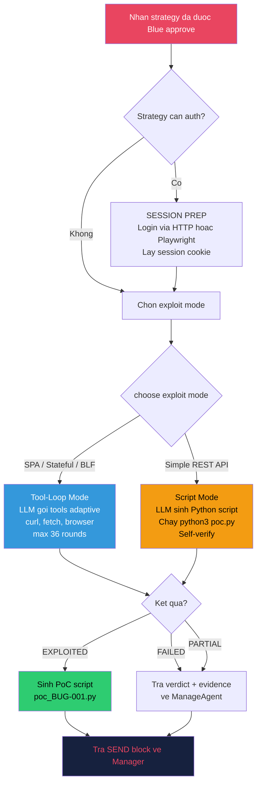
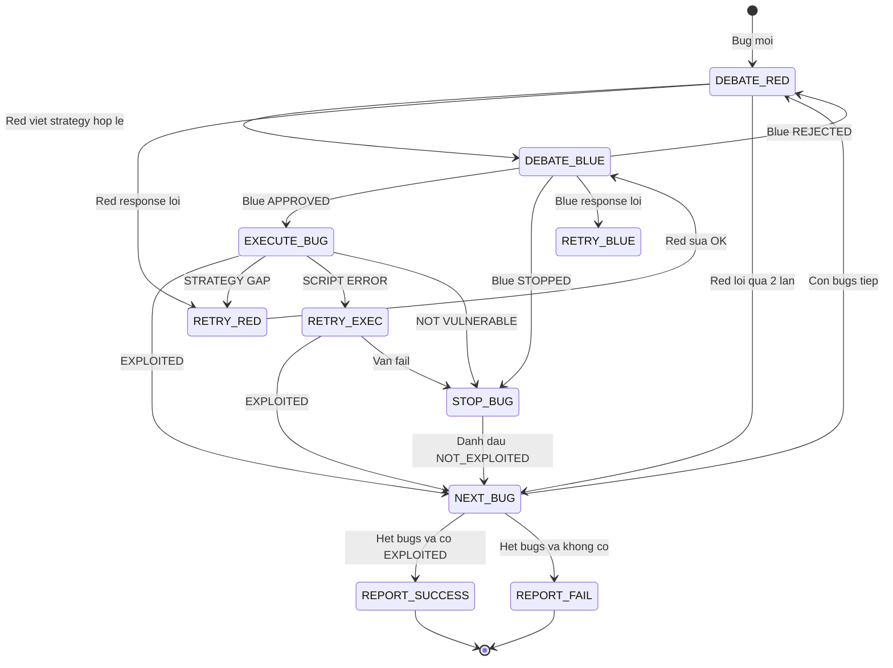
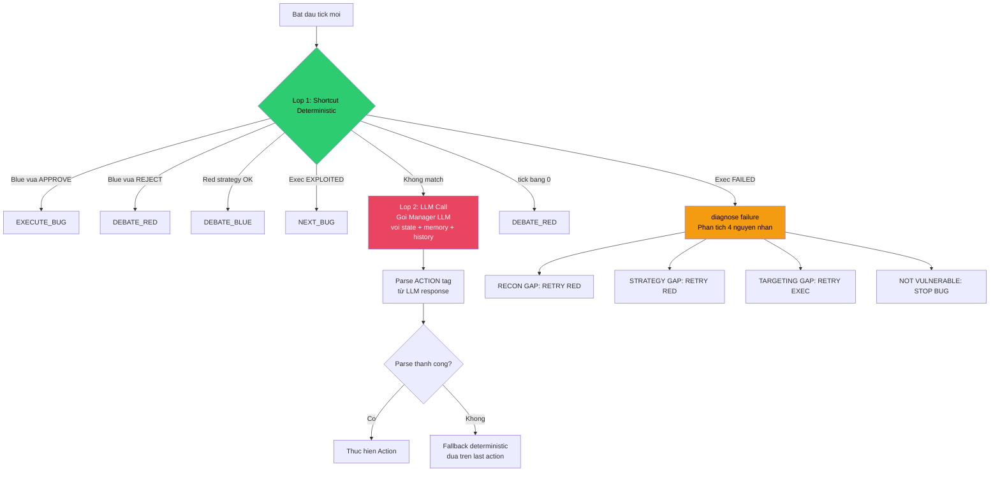
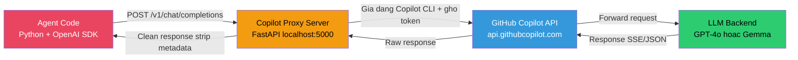

# 🏗️ Kiến Trúc Hệ Thống MARL
## Multi-Agent Reinforcement Learning for Automated Penetration Testing

> **Đồ án chuyên ngành** — Trường Đại học Công nghệ Thông tin (UIT)
>
> Hệ thống kiểm thử thâm nhập tự động sử dụng kiến trúc đa tác tử (multi-agent),
> tập trung phát hiện lỗ hổng **Broken Access Control (BAC)** và **Business Logic Flaw (BLF)**.

---

## 1. Tổng Quan Hệ Thống

### 1.1 Mục tiêu

MARL tự động hóa quy trình pentest thông qua nhiều agent AI chuyên biệt, mỗi agent đảm nhận một vai trò riêng biệt (trinh sát, tấn công, phản biện, thực thi). Các agent **không giao tiếp trực tiếp** với nhau mà phối hợp thông qua một agent trung tâm — **ManageAgent** ("Sếp").

### 1.2 Kiến trúc tổng thể

```
┌─────────────────────────────────────────────────────────────────────┐
│                         USER (Terminal / CLI)                       │
│                    python main.py "prompt + URL"                    │
└──────────────────────────────┬──────────────────────────────────────┘
                               │
                               ▼
┌─────────────────────────────────────────────────────────────────────┐
│                       ORCHESTRATOR (main.py)                        │
│  • Parse CLI arguments, tạo workspace, setup logging                │
│  • Điều phối Phase 1 (Recon) → Phase 2-5 (ManageAgent)             │
└───────────┬─────────────────────────────────┬───────────────────────┘
            │                                 │
            ▼                                 ▼
  ┌──────────────────┐            ┌───────────────────────────────┐
  │   PHASE 1: RECON │            │   PHASE 2-5: ORCHESTRATION    │
  │                  │            │                               │
  │  CrawlAgent      │            │  ManageAgent ("Sếp")          │
  │  VulnHunterAgent │            │    ├── RedTeamAgent           │
  │                  │            │    ├── BlueTeamAgent          │
  │  Output:         │            │    ├── ExecAgent              │
  │  • crawl_data    │            │    └── PolicyAgent            │
  │  • recon.md      │            │                               │
  │  • risk-bug.json │            │  Output:                      │
  └──────────────────┘            │  • report.md                  │
                                  │  • poc_BUG-XXX.py             │
                                  └───────────────────────────────┘
```

### 1.3 Mô hình giao tiếp: Manager-Agent Pattern



> **Nguyên tắc cốt lõi:** Các agent hoạt động **hoàn toàn cách ly** — RedTeam không biết BlueTeam tồn tại,
> BlueTeam không biết ExecAgent tồn tại. Mọi thông tin đều đi qua ManageAgent.
> Điều này giảm coupling, tăng tính mở rộng, và cho phép thay thế bất kỳ agent nào mà không ảnh hưởng hệ thống.

---

## 2. Pipeline 5 Giai Đoạn



### 2.1 Phase 1: TRINH SÁT (Recon)

**Mục đích:** Thu thập toàn bộ thông tin về target website.

**Agent thực hiện:** `CrawlAgent` + `VulnHunterAgent`

**Luồng thực thi:**



**Công nghệ crawl mục tiêu:**
- **Hybrid deterministic + AI-guided crawl**: BFS duyệt same-origin links/routes, sau đó LLM chọn một số action đáng thử từ inventory hiện tại.
- **Playwright network capture**: trình duyệt headless intercept mọi HTTP request/response quan trọng.
- **Action inventory**: mỗi page/state trích links, forms, buttons, selectors, fields, method, text, risk policy.
- **LLM action planner**: dùng model từ `.env` (`MARL_CRAWL_MODEL`, fallback `MARL_EXECUTOR_MODEL`) để chọn JSON action contract, không click tuỳ tiện.
- **Safety policy**: phân loại navigation/read-only/reversible/state-changing/destructive; chỉ cho phép action an toàn hoặc bounded state-changing như add-to-cart.
- **Workflow graph**: lưu page graph, request graph, observed actions, AI decisions, request chains, state_before/state_after, emitted requests, numeric/id fields.
- Capture: method, URL, headers, postData, response body (max 12KB), parent page, form fields, JSON keys, numeric fields, object/id fields.

**Output:**

| File | Mô tả |
|------|--------|
| `crawl_data.txt` | Raw HTTP traffic (mọi request/response) |
| `crawl_raw.json` | Structured map: pages, HTTP traffic, action inventory, AI decisions, workflow_graph, business_chain, request_chains |
| `business_flows.json` | LLM-mapped business flows từ request-chain/workflow graph |
| `recon.md` | Deterministic summary: endpoints, forms, auth flows, workflow graph, attack surface |
| `risk-bug.json` | Danh sách N bug candidates với metadata chi tiết |

### 2.2 Phase 2: PHÂN LOẠI (Candidate Queue)

**Agent thực hiện:** `ManageAgent`

ManageAgent load `risk-bug.json`, enriche metadata, và xây dựng **bug queue**.
Bugs được sắp xếp: anonymous-first (không cần auth) trước, auth-required sau.

Mỗi bug chứa:
```json
{
  "id": "BUG-001",
  "pattern_id": "BAC-03",
  "risk_level": "HIGH",
  "method": "GET",
  "endpoint": "/api/users/{id}",
  "hypothesis": "IDOR — user A có thể xem data user B",
  "auth_required": true,
  "exploit_approach": "Thay đổi ID trong URL",
  "verify_method": "So sánh response với ID khác",
  "status": "PENDING"
}
```

### 2.3 Phase 3: TRANH LUẬN (Red-Blue Debate)

**Agent thực hiện:** `RedTeamAgent` ↔ `BlueTeamAgent` (qua ManageAgent)



**RedTeam output format:**
```
=== CHIẾN LƯỢC tấn công cho BUG-001 ===
Mục tiêu: IDOR trên GET /api/users/{id}
Pattern: BAC-03 (IDOR)
...

=== EXECUTION GUIDE ===
Approach: api_first
Step 1: Login user A → lấy session cookie
Step 2: GET /api/users/2 với cookie user A  
Step 3: So sánh: nếu thấy data user B → EXPLOITED
```

### 2.4 Phase 4: THỰC THI (Execution)

**Agent thực hiện:** `ExecAgent`



**Hai chế độ thực thi:**

| Mode | Khi nào | Cách hoạt động |
|------|---------|----------------|
| **Tool-Loop** | SPA, stateful, BLF | LLM gọi MCP tools adaptive (curl, browser, fetch) lặp đi lặp lại |
| **Script-First** | Simple REST API | LLM sinh Python script, chạy 1 lần, script tự verify kết quả |

**Script tự verify:** Script in `=== FINAL: EXPLOITED ===` hoặc `=== FINAL: FAILED ===` để Manager đọc.

### 2.5 Phase 5: BÁO CÁO (Report)

ManageAgent tổng hợp kết quả tất cả bugs → `report.md`:
- **SUCCESS**: Có ít nhất 1 bug EXPLOITED + evidence + PoC script
- **FAIL**: Không có bug nào được khai thác thành công

---

## 3. Máy Trạng Thái Per-Bug (State Machine)

Mỗi bug đi qua một máy trạng thái do ManageAgent điều khiển:



**Giới hạn (Guardrails):**

| Tham số | Giá trị | Ý nghĩa |
|---------|---------|---------|
| `MAX_ROUNDS` | 2 | Số lần Red được viết lại strategy |
| `MAX_EXEC_RETRIES` | 1 | Số lần Exec được chạy lại |
| `MAX_TICKS` | 60+ | Tổng số bước tối đa (dynamic: 8 × số bugs) |
| `EXEC_TIMEOUT` | 4800s | Timeout ExecAgent (80 phút) |

---

## 4. Bộ Quyết Định — _decide()

ManageAgent dùng cơ chế **2 lớp** để quyết định bước tiếp theo mỗi tick:



> **Ưu tiên shortcut deterministic** trước LLM → tiết kiệm tokens, tăng tốc pipeline, đảm bảo tính nhất quán.

---

## 5. Thành Phần Chi Tiết

### 5.1 Bảng tổng hợp các Agent

| Agent | File | Vai trò | Input | Output |
|-------|------|---------|-------|--------|
| **CrawlAgent** | `agents/crawl_agent.py` | Crawl website, thu thập HTTP traffic | URL + credentials | `crawl_data.txt`, `recon.md` |
| **VulnHunterAgent** | `agents/vuln_hunter_agent.py` | Phân tích traffic → phát hiện bug candidates | recon.md + crawl_data | `risk-bug.json` |
| **ManageAgent** | `agents/manage_agent.py` | Điều phối toàn bộ pipeline, quyết định mỗi tick | risk-bug.json + conversation | Actions + Report |
| **RedTeamAgent** | `agents/red_team.py` | Viết chiến lược tấn công + execution guide | Bug dossier + memory | Strategy text |
| **BlueTeamAgent** | `agents/blue_team.py` | Review strategy, đánh giá tính khả thi | Red strategy + bug context | APPROVED / REJECTED / STOPPED |
| **ExecAgent** | `agents/exec_agent.py` | Thực thi exploit, sinh PoC | Approved strategy | Verdict + Evidence + PoC |
| **PolicyAgent** | `agents/policy_agent.py` | Kiểm soát luật, ngăn chặn state sai | Action + state | BLOCK / SUGGEST / ALLOW |

### 5.2 Shared Infrastructure

```mermaid
graph LR
    subgraph "MemoryStore - Bộ nhớ bền vững"
        TR["task_registry.json\nTask tracking"]
        FD["findings.json\nFacts phát hiện"]
        CL["conversation_full.jsonl\nToàn bộ hội thoại"]
        SM["conversation_summary.md\nTóm tắt rolling"]
        SP["scratchpad\nGhi chú per-agent"]
        TR --- FD --- CL --- SM --- SP
    end

    subgraph "ContextManager - Quản lý ngữ cảnh"
        COMP["Nén khi > 20 tin\nGiữ 6 tin gần nhất\nLLM tóm tắt phần cũ"]
        RAG["RAG-style retrieval\nTìm context theo keyword\nInject vào prompt"]
        COMP --- RAG
    end

    subgraph "MCPManager - Cầu nối Tool"
        FS["Filesystem Server\nread/write/edit file"]
        FT["Fetch Server\nHTTP requests"]
        SH["Shell Server\nTerminal commands"]
        PW["Playwright Server\nBrowser automation"]
        WS["Web Search\nDuckDuckGo"]
        FS --- FT --- SH --- PW --- WS
    end

    SM --> COMP
    RAG --> FS

    style TR fill:#1abc9c,color:#000
    style FD fill:#1abc9c,color:#000
    style CL fill:#1abc9c,color:#000
    style SM fill:#1abc9c,color:#000
    style SP fill:#1abc9c,color:#000
    style COMP fill:#3498db,color:#fff
    style RAG fill:#3498db,color:#fff
    style FS fill:#9b59b6,color:#fff
    style FT fill:#9b59b6,color:#fff
    style SH fill:#9b59b6,color:#fff
    style PW fill:#9b59b6,color:#fff
    style WS fill:#9b59b6,color:#fff
```



### 5.3 Knowledge Base — BAC/BLF Playbook

Hệ thống tích hợp **knowledge base** chứa các pattern tấn công đã được nghiên cứu:

| Category | Patterns | Ví dụ |
|----------|----------|-------|
| **BAC** (Broken Access Control) | BAC-01 → BAC-N | Admin bypass, privilege escalation, IDOR, method override |
| **BLF** (Business Logic Flaw) | BLF-01 → BLF-N | Price manipulation, quantity tampering, state skipping |

Mỗi pattern chứa: **indicators** (dấu hiệu), **technique** (kỹ thuật), **variations** (biến thể), **success criteria** (tiêu chí thành công).

Playbook được inject vào system prompt của Red, Blue, và Manager → agents có kiến thức chuyên sâu về BAC/BLF.

---

## 6. Luồng Thực Thi End-to-End

```mermaid
sequenceDiagram
    participant U as User
    participant MAIN as main.py
    participant CRAWL as CrawlAgent
    participant HUNTER as VulnHunter
    participant MGR as ManageAgent
    participant RED as RedTeam
    participant BLUE as BlueTeam
    participant EXEC as ExecAgent
    participant MCP as MCP Tools

    U->>MAIN: python main.py URL + credentials

    Note over MAIN: Setup: parse args, tao workspace, logging

    rect rgb(15, 52, 96)
        Note over CRAWL,HUNTER: Phase 1 - TRINH SAT
        MAIN->>CRAWL: crawl.run(user_prompt)
        CRAWL->>MCP: BFS Crawl + Playwright
        MCP-->>CRAWL: HTTP traffic N requests
        CRAWL->>CRAWL: Login tung account
        CRAWL->>MCP: Authenticated Crawl
        MCP-->>CRAWL: Auth traffic
        CRAWL->>CRAWL: LLM tong hop ra recon.md
        CRAWL-->>MAIN: recon.md
        MAIN->>HUNTER: VulnHunter(recon, crawl_data)
        HUNTER->>HUNTER: LLM phan tich ra risk-bug.json
        HUNTER-->>MAIN: risk-bug.json N bugs
    end

    MAIN->>MGR: ManageAgent(target, recon, run_dir)
    MAIN->>MGR: manager.run(conversation)

    rect rgb(83, 52, 131)
        Note over MGR: Phase 0 - Context Review
        MGR->>MGR: Danh gia recon quality + auth
        MGR->>MGR: Sort bugs anonymous-first
    end

    loop Voi moi BUG trong risk-bug.json
        rect rgb(180, 60, 80)
            Note over RED,BLUE: Phase 3 - RED-BLUE DEBATE
            MGR->>RED: Viet strategy cho BUG-XXX
            RED-->>MGR: Strategy + Execution Guide
            MGR->>BLUE: Review strategy
            BLUE-->>MGR: APPROVED hoac REJECTED
        end

        rect rgb(40, 140, 90)
            Note over EXEC,MCP: Phase 4 - THUC THI
            MGR->>EXEC: run_workflow(approved_strategy)
            EXEC->>MCP: Login lay session cookie
            EXEC->>MCP: Exploit tool-loop hoac script
            MCP-->>EXEC: HTTP responses
            EXEC-->>MGR: Verdict + Evidence
            MGR->>MGR: Phan tich ket qua
            alt EXPLOITED
                MGR->>MGR: Danh dau thanh cong, next bug
            else FAILED
                MGR->>MGR: diagnose_failure, Retry hoac STOP
            end
        end
    end

    rect rgb(22, 33, 62)
        Note over MGR: Phase 5 - BAO CAO
        MGR->>MGR: _write_report()
        MGR-->>MAIN: report.md + poc_BUG-XXX.py
    end

    MAIN-->>U: Pipeline hoan tat
```



---

## 7. Cấu Trúc Workspace (Runtime)

Mỗi lần chạy tạo ra một workspace riêng biệt:

```
workspace/{domain}_{timestamp}/
│
├── crawl_data.txt              ← Raw HTTP traffic từ crawler
├── recon.md                    ← LLM tổng hợp recon
├── risk-bug.json               ← Danh sách bug candidates  
├── marl.log                    ← Full pipeline log
├── report.md                   ← Báo cáo cuối cùng
├── poc_BUG-001.py              ← PoC script (nếu EXPLOITED)
├── poc_BUG-003.py              ← PoC cho bug khác
│
├── auth_context.json           ← Auth sessions (cookies, tokens)
├── storage_state.json          ← Playwright browser state
├── cookies.txt                 ← HTTP cookies (Netscape format)
│
├── memory/                     ← Bộ nhớ bền vững
│   ├── task_registry.json      ← Task tracking
│   ├── findings.json           ← Facts đã phát hiện
│   ├── conversation_full.jsonl ← Toàn bộ hội thoại (append-only)
│   ├── conversation_summary.md ← Tóm tắt rolling
│   └── scratchpad/
│       ├── red_notes.json      ← Ghi chú Red agent
│       ├── blue_notes.json     ← Ghi chú Blue agent
│       └── exec_notes.json     ← Ghi chú Exec agent
│
└── exploit_state/              ← State cho tool-loop exploit
    └── BUG-001/
        └── evidence_*.json
```

---

## 8. Chuỗi Gọi LLM (LLM Call Chain)



**Copilot Proxy Server** (`server/server.py`):
- Nhận request từ agents qua OpenAI-compatible API
- Forward tới GitHub Copilot API với identity headers giả dạng Copilot CLI
- Clean response: strip metadata, convert Responses API → Chat format
- Token pool round-robin + exponential backoff retry

---

## 9. Cấu Trúc Thư Mục Source Code

```
MARL/
├── main.py                     ← Entry point duy nhất
│
├── agents/                     ← Các agent AI
│   ├── manage_agent.py         ← "Sếp" — điều phối (~3400 dòng)
│   ├── crawl_agent.py          ← Trinh sát + crawl
│   ├── vuln_hunter_agent.py    ← Phân tích lỗ hổng
│   ├── red_team.py             ← Đề xuất chiến lược tấn công
│   ├── blue_team.py            ← Phản biện & review
│   ├── exec_agent.py           ← Thực thi exploit (~3800 dòng)
│   └── policy_agent.py         ← Guardrail / kiểm soát luật
│
├── shared/                     ← Module dùng chung
│   ├── memory_store.py         ← Bộ nhớ bền vững (file-backed)
│   ├── context_manager.py      ← Nén hội thoại + RAG
│   ├── auth_context.py         ← Quản lý auth sessions
│   ├── bug_dossier.py          ← Enrich bug metadata
│   ├── utils.py                ← Tiện ích: parse, truncate, regex
│   └── logger.py               ← Logging system
│
├── tools/                      ← Công cụ hỗ trợ
│   └── crawler.py              ← BFS web crawler (Playwright)
│
├── knowledge/                  ← Knowledge base
│   ├── bac_blf_playbook.py     ← Pattern loader
│   ├── bac_knowledge.json      ← BAC attack patterns
│   └── blf_knowledge.json      ← BLF attack patterns
│
├── server/                     ← API proxy server
│   └── server.py               ← FastAPI Copilot proxy
│
├── mcp_client.py               ← MCP tool bridge
├── workspace/                  ← Runtime output (per-target)
└── requirements.txt            ← Python dependencies
```

---

## 10. Công Nghệ Sử Dụng

| Layer | Công nghệ | Vai trò |
|-------|-----------|---------|
| **Ngôn ngữ** | Python 3.10+ | Core language |
| **LLM Framework** | OpenAI SDK | Giao tiếp với LLM |
| **Web Crawling** | Playwright | Browser automation, BFS crawl |
| **Tool Protocol** | MCP (Model Context Protocol) | Kết nối LLM ↔ Tools |
| **API Server** | FastAPI + httpx | Copilot proxy server |
| **Web Search** | DuckDuckGo (ddgs) | Built-in search, không cần API key |
| **Storage** | JSON/JSONL files | Bộ nhớ bền vững, append-only log |
| **Auth** | GitHub Copilot Token (gho_) | LLM access |

---

## 11. Điểm Nổi Bật Kiến Trúc

| # | Đặc điểm | Giải thích |
|---|----------|------------|
| 1 | **Agent Isolation** | Agents không biết nhau → giảm coupling, dễ mở rộng |
| 2 | **LLM-Driven State Machine** | Manager dùng LLM để ra quyết định, không hard-coded |
| 3 | **Deterministic Shortcuts** | Shortcut trước, LLM fallback → nhanh + tiết kiệm tokens |
| 4 | **Self-Verifying Exploits** | Script tự in verdict → không cần human judge |
| 5 | **Proof Gate** | Yêu cầu evidence cụ thể cho từng loại BAC/BLF |
| 6 | **Context Compression** | Auto-compress conversation khi quá dài → tránh vượt context window |
| 7 | **Persistent Memory** | File-backed storage, survive process restart |
| 8 | **Failure Diagnosis** | 4 loại nguyên nhân thất bại: RECON_GAP, STRATEGY_GAP, TARGETING_GAP, NOT_VULNERABLE |
| 9 | **Workspace Reuse** | Skip recon nếu đã có data → tiết kiệm thời gian |
| 10 | **Knowledge Base** | BAC/BLF playbook inject vào agents → kiến thức chuyên sâu |

---

*Tài liệu được tạo tự động từ phân tích mã nguồn — MARL v2.0*
