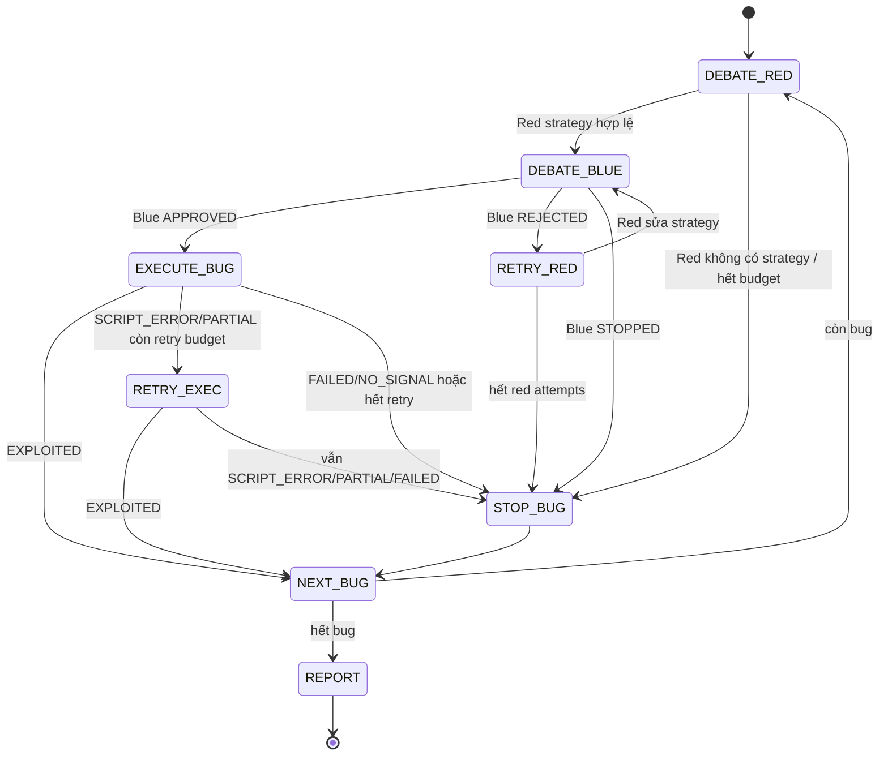

# Báo cáo cập nhật dự án MARL Pentest Agent

Ngày cập nhật: 09/05/2026

## 1. Tóm tắt hiện trạng

Dự án hiện tại đã đạt mức **prototype chạy được theo kiến trúc chính của đồ án**: hệ thống có thể crawl target, tạo hồ sơ recon, sinh danh sách giả thuyết lỗ hổng BAC/BLF, để Red Team đề xuất chiến lược, Blue Team phản biện chiến lược, Exec Agent thực thi PoC có lưu artifact, Manager điều phối luồng và sinh báo cáo cuối.

Trạng thái hiện tại phù hợp để báo cáo đồ án ở mức:

- Có kiến trúc multi-agent rõ ràng.
- Có pipeline tự động từ recon đến report.
- Có cơ chế giảm token bằng memory/context thay vì gửi toàn bộ conversation thô.
- Có cơ chế self-verifying exploit: Exec tự khai thác, tự xác minh trong Python script, Manager đọc verdict/evidence để quyết định.
- Có lưu lại PoC, script, log, response artifact để chứng minh quá trình khai thác.

Điểm cần lưu ý khi demo: hệ thống phụ thuộc vào LLM proxy đang chạy và token hợp lệ. Kiểm tra gần nhất cho thấy code compile ổn, nhưng endpoint GitHub Copilot proxy cần token hợp lệ để chạy end-to-end.

## 2. Mục tiêu đồ án

Mục tiêu ban đầu của dự án là xây dựng một hệ thống multi-agent hỗ trợ kiểm thử xâm nhập tự động cho nhóm lỗi:

- `BAC` - Broken Access Control.
- `BLF` - Business Logic Flaw.

Trọng tâm không phải là giải một lab cụ thể, mà là chứng minh hệ thống có thể:

- Thu thập ngữ cảnh website.
- Tạo giả thuyết lỗ hổng.
- Lập chiến lược khai thác.
- Phản biện chiến lược.
- Thực thi PoC.
- Xác minh bằng chứng.
- Viết báo cáo kết quả dù thành công hay thất bại.

Một mục tiêu phụ quan trọng là **giảm token gửi lên server LLM** bằng cách dùng memory/context summary và artifact thay vì đẩy toàn bộ conversation history hoặc raw crawl data vào từng agent.

## 3. Kiến trúc tổng thể hiện tại

```text
[Người dùng nhập prompt target]
            |
        [main.py]
            |
      [CrawlAgent]
      |     |     |
      |     |  [recon.md enriched]
      |     |          |
      |  [crawl_raw.json]   [VulnHunterAgent]
      |                          |
   [crawl_data.txt]       [risk-bug.json]
                                 |
                          [ManageAgent] <---> [PolicyAgent]
                         /      |      \
               [RedTeamAgent]   |   [BlueTeamAgent]
                         \      |      /
                          [ExecAgent]
                         /      |      \
              [exploits/]  [exploit_state/]  [artifacts]
                         \      |      /
                          [ManageAgent]
                         /      |      \
               [report.md] [report_raw.md] [report_final_vi.md]
```

## 4. Vai trò từng agent

| Thành phần | Vai trò hiện tại | Ghi chú |
|---|---|---|
| `CrawlAgent` | Crawl website ở anonymous/authenticated mode, lưu traffic và sinh `recon.md` giàu ngữ cảnh | Đây là nguồn dữ liệu chính cho các bước sau |
| `VulnHunterAgent` | Đọc toàn bộ `recon.md` enriched để sinh danh sách candidate bug vào `risk-bug.json` | Ưu tiên recall cao, chấp nhận false positive |
| `ManageAgent` | Điều phối toàn bộ worker agent, chọn action, kiểm soát retry/stop/report | Là "ông sếp" trong mô hình doanh nghiệp của dự án |
| `PolicyAgent` | Guardrail nội bộ đứng cạnh Manager, kiểm tra luật state machine | Red/Blue/Exec không gọi Policy trực tiếp |
| `RedTeamAgent` | Viết chiến lược khai thác và `EXECUTION SHOT PLAN` cho một bug cụ thể | Không dùng tool, không viết code trực tiếp |
| `BlueTeamAgent` | Review chiến lược và shot plan của Red trước khi Exec chạy | Đây là core debate của đồ án |
| `ExecAgent` | Thực thi Python exploit, lưu PoC/artifact, tự verify trong script | Script tự in `FINAL: EXPLOITED/PARTIAL/FAILED` |
| `MemoryStore` / `ContextManager` | Lưu scratchpad, finding, context summary để giảm token | Tránh gửi full history lặp lại |

## 5. Luồng chạy hiện tại

Luồng chính hiện tại:

```text
[RECON]
  --> [VULN HUNTER]
        --> [BUG QUEUE]
              --> [RED STRATEGY]
                    --> [BLUE REVIEW]
                          |
                          +--(APPROVED)--> [EXEC EXPLOIT]
                          |                     |
                          +--(REJECTED)--> quay lại RED    +--(EXPLOITED)  --> [NEXT BUG]
                                                           |
                                                           +--(SCRIPT_ERROR) --> [RETRY EXEC]
                                                           |
                                                           +--(PARTIAL)     --> [RETRY EXEC]
                                                           |
                                                           +--(FAILED)      --> [STOP BUG]
                                                                                     |
                                                                               [NEXT BUG]
                                                                                     |
                                                                         (hết bug) [REPORT]
```


Điểm quan trọng sau các lần chỉnh sửa:

- `BlueTeam` chỉ review **chiến lược của Red trước Exec**.
- Đã bỏ Blue review sau khi Exec chạy, vì phần này làm pipeline khắt khe và dễ retry vòng lặp.
- Sau Exec, `ManageAgent` đọc trực tiếp `SUCCESS`, `FINAL`, `result.json` và evidence summary.
- Exec tự xác minh trong chính Python exploit, không còn verifier thứ hai trong hot path.
- Hệ thống dùng nguyên tắc `minimum sufficient proof`: nếu evidence đủ chứng minh hypothesis thì chốt, không bắt thêm endpoint/tác động phụ.

## 6. Sequence diagram cho một bug

```text
ManageAgent         RedTeamAgent        BlueTeamAgent       ExecAgent
     |                   |                   |                  |
     |-- giao bug ------->|                   |                  |
     |   + dossier        |                   |                  |
     |   + attempt ledger |                   |                  |
     |                   |                   |                  |
     |<-- Strategy -------|                   |                  |
     |    + SHOT PLAN     |                   |                  |
     |                   |                   |                  |
     |-- gửi strategy để review ------------>|                  |
     |                                       |                  |
     |<-- APPROVED / REJECTED / STOPPED -----|                  |
     |                                                          |
     |  [nếu APPROVED]                                          |
     |-- chạy exploit theo approved workflow ------------------>|
     |                                                          |
     |<-- FINAL verdict + result.json + artifacts --------------|
     |
     |  Đọc kết quả:
     |    EXPLOITED    --> chuyển bug tiếp theo
     |    PARTIAL      --> retry Exec tối đa 1 lần
     |    SCRIPT_ERROR --> retry Exec tối đa 1 lần
     |    FAILED       --> dừng bug
     |
     |  [nếu REJECTED]
     |-- yêu cầu Red sửa strategy trong budget
```

## 7. Các artifact sinh ra khi chạy

Mỗi lần chạy tạo một workspace dạng:

```text
workspace/<domain>_<timestamp>/
├── marl.log
├── crawl_data.txt
├── crawl_raw.json
├── recon.md
├── risk-bug.json
├── exploits/
│   ├── bug-001-exploit1.sh
│   ├── bug-001-exploit1.sh.syntax.txt
│   ├── bug-001-exploit1.sh.output.txt
│   └── ...
├── exploit_state/
│   └── BUG-001/
│       ├── baseline.req.txt
│       ├── baseline.resp.txt
│       ├── probe.req.txt
│       ├── probe.resp.txt
│       ├── verify.req.txt
│       ├── verify.resp.txt
│       └── result.json
├── report_raw.md
├── report_final_vi.md
└── report.md
```

Ý nghĩa:

- `marl.log`: log realtime để theo dõi agent nào đang làm gì.
- `recon.md`: bản tóm tắt giàu ngữ cảnh từ crawl, dùng làm input chính cho VulnHunter.
- `risk-bug.json`: danh sách bug candidate và trạng thái xử lý.
- `exploits/`: các script PoC được lưu theo từng bug và từng shot.
- `exploit_state/`: raw request/response phục vụ chứng minh PoC.
- `report_raw.md`: báo cáo kỹ thuật thô.
- `report_final_vi.md`: báo cáo tiếng Việt sạch hơn.
- `report.md`: báo cáo cuối cùng.

## 8. Các cập nhật chính đã làm gần đây

### 8.1. Làm sạch kiến trúc Manager-led workflow

Trước đây các agent có xu hướng tự gắn tag hoặc điều hướng lẫn nhau. Hiện tại đã chuyển về mô hình:

- `ManageAgent` là router duy nhất.
- `PolicyAgent` chỉ đứng cạnh Manager.
- Red/Blue/Exec không tự gọi Policy.
- Red/Blue không tự điều phối Exec.

Điều này làm luồng chạy dễ giải thích hơn khi báo cáo:

```text
Manager = người quản lý luồng
Policy = thư ký kiểm luật
Red = chiến lược gia tấn công
Blue = phản biện chiến lược
Exec = người thực thi kỹ thuật
```

### 8.2. Làm giàu recon.md và giảm phụ thuộc crawl_data.txt

Ban đầu VulnHunter đọc `crawl_data.txt` quá dài, dễ bị mất ngữ cảnh hoặc chỉ đọc được đoạn đầu. Hiện tại:

- `CrawlAgent` tạo `recon.md` enriched.
- `recon.md` mô tả endpoint, request, response, form fields, cookie surface, route family.
- `VulnHunterAgent` đọc toàn bộ `recon.md` thay vì đọc raw crawl data trực tiếp.

Lợi ích:

- Giảm token.
- Tăng chất lượng bug candidate.
- Agent hiểu website theo dạng mô tả nghiệp vụ thay vì đọc HTML/JSON thô quá dài.

### 8.3. VulnHunter ưu tiên recall cao

VulnHunter được chỉnh theo hướng:

- Nghi đâu báo đó.
- Không cần confirm 100%.
- Sinh nhiều candidate BAC/BLF hơn.
- False positive sẽ được xử lý ở Red/Blue/Exec/Manager.

Đây là hướng phù hợp với pipeline nhiều agent vì giai đoạn đầu nên ưu tiên không bỏ sót.

### 8.4. Khôi phục Red/Blue debate là core của đồ án

Hiện tại Blue review chiến lược của Red là bước bắt buộc trước Exec:

```text
Red strategy -> Blue review -> Exec exploit
```

Blue có quyền:

- `APPROVED`: chiến lược đủ rõ để Exec chạy.
- `REJECTED`: Red phải sửa strategy/shot plan.
- `STOPPED`: candidate không còn đáng khai thác.

Blue không còn review evidence sau Exec. Việc này giúp giữ đúng mục tiêu đồ án: Blue là reviewer chiến lược, không phải verifier runtime.

### 8.5. Chuẩn hóa shot plan và exploit artifacts

Red phải viết section:

```text
=== EXECUTION SHOT PLAN ===
...
=== END EXECUTION SHOT PLAN ===
```

Exec dùng shot plan để sinh script exploit. Mỗi script được lưu riêng:

```text
exploits/bug-001-exploit1.sh
exploits/bug-001-exploit2.sh
```

Lợi ích:

- Không mất PoC khi script bị ghi đè.
- Báo cáo cuối có thể trích dẫn lại exploit script.
- Có thể xem từng shot đã làm gì và lỗi ở đâu.

### 8.6. Đơn giản hóa post-Exec decision

Pipeline đã bỏ các lớp hậu kiểm runtime phức tạp cũ, bao gồm guard deterministic, verifier riêng sau Exec, review runtime phụ và log summary nhiễu.

Hiện tại Exec Python script phải tự:

- chạy exploit;
- kiểm tra điều kiện thành công;
- lưu raw request/response/result artifact;
- in `SHOT_RESULT`;
- in `=== FINAL: EXPLOITED/PARTIAL/FAILED ===`;
- ghi `result.json`.

Manager chỉ đọc kết quả này để quyết định:

- `EXPLOITED` -> chuyển bug tiếp theo;
- `PARTIAL` -> retry Exec tối đa một lần;
- `FAILED` -> dừng bug;
- `SCRIPT_ERROR` -> retry Exec tối đa một lần.

### 8.7. Thêm rào chống overfitting

Các prompt Red, Blue, Exec và Manager được bổ sung luật:

- Không hardcode endpoint/marker/account của một lab cụ thể.
- Endpoint, marker, payload phải lấy từ `risk-bug.json`, `recon.md`, strategy hoặc artifact hiện tại.
- Không yêu cầu endpoint phụ hoặc tác động phụ nếu hypothesis đã được chứng minh.
- BAC vertical: user thường/guest thấy privileged page/control/admin marker là đủ.
- IDOR/BAC horizontal: user A đọc được object/data của user B là đủ.
- BLF/stateful: cần before/after state, delta hoặc state transition trái logic.

### 8.8. Memory và context compression

Hệ thống có `MemoryStore` và `ContextManager` để:

- Lưu scratchpad từng agent.
- Lưu finding/attempt ledger.
- Chỉ lấy context liên quan cho từng agent.
- Giảm việc gửi toàn bộ conversation history lên LLM.

Điều này phù hợp với mục tiêu ban đầu: dùng memory để quản lý conversation history và giảm token gửi lên server.

## 9. Trạng thái ổn định hiện tại

Đánh giá kỹ thuật hiện tại:

| Hạng mục | Trạng thái | Nhận xét |
|---|---|---|
| Syntax Python | Ổn | Đã compile các module chính thành công |
| Kiến trúc agent | Ổn | Manager là router duy nhất, Blue nằm đúng vị trí strategy gate |
| Luồng dữ liệu | Khá ổn | recon -> risk-bug -> Red strategy -> Blue review -> Exec exploit tự verify -> Manager decision -> report đã rõ |
| Artifact PoC | Ổn | Script, output, syntax log, request/response được lưu theo bug |
| Report | Khá ổn | Có raw report và final Vietnamese report |
| False positive handling | Cố ý nới lỏng | Chấp nhận candidate proof tối thiểu để tránh overfitting; false positive được ghi rõ trong report nếu Exec/Manager không đủ bằng chứng |
| E2E runtime | Phụ thuộc môi trường | Cần LLM proxy/token hợp lệ và target đang chạy |
| Tính tổng quát | Khá ổn cho BAC/BLF | Chưa hướng đến toàn bộ nhóm lỗi web như SQLi/XSS/SSRF |

Kiểm tra gần nhất:

```bash
python -m py_compile main.py agents/manage_agent.py agents/crawl_agent.py agents/vuln_hunter_agent.py agents/red_team.py agents/blue_team.py agents/exec_agent.py agents/policy_agent.py shared/bug_dossier.py shared/context_manager.py shared/memory_store.py mcp_client.py
```

Kết quả: không có lỗi syntax.

## 10. Trạng thái môi trường chạy hiện tại

Cấu hình runtime hiện tại dùng OpenAI-compatible proxy:

```text
MARL_SERVER_URL=http://127.0.0.1:5000/v1
```

Các model trong `.env` đang được chia theo nhóm:

- Tool-heavy agents: `gpt-4.1`.
- Reasoning/orchestration agents: `gpt-5-mini`.

Lưu ý khi demo:

- Proxy phải đang chạy ở `127.0.0.1:5000`.
- Proxy phải có GitHub/Copilot token hợp lệ hoặc token pool hợp lệ.
- Nếu `.env` vẫn để placeholder `GITHUB_TOKEN=gho_token`, request trực tiếp tới `/v1/models` có thể trả `401`.
- Đây là lỗi môi trường/token, không phải lỗi syntax pipeline.

## 11. Khi chạy hiện tại sẽ diễn ra như thế nào

Ví dụ lệnh chạy:

```bash
python main.py "Test http://localhost:5001 user:... pass:..."
```

Quy trình dự kiến:

1. `main.py` tạo workspace mới hoặc reuse workspace cũ.
2. `CrawlAgent` crawl target:
   - anonymous crawl
   - authenticated crawl nếu có credential
   - lưu `crawl_data.txt`, `crawl_raw.json`
   - tạo `recon.md`
3. `VulnHunterAgent` đọc `recon.md`:
   - sinh candidate bug BAC/BLF
   - lưu `risk-bug.json`
4. `ManageAgent` xử lý từng bug:
   - gửi bug dossier cho Red
   - nhận strategy và shot plan
   - gửi Blue review
   - nếu Blue approve thì gửi Exec chạy exploit
5. `ExecAgent`:
   - chuẩn bị session/cookie
   - sinh Python exploit theo strategy đã approve
   - chạy `python3 -m py_compile`
   - chạy script và tự in `SHOT_RESULT`, `EVIDENCE_SUMMARY`, `FINAL`
   - lưu output và artifact
6. `ManageAgent`:
   - đọc Exec output
   - nếu evidence đạt proof tối thiểu của hypothesis thì đánh dấu `EXPLOITED`
   - nếu script/runtime lỗi thì retry Exec tối đa 1 lần
   - nếu không có tín hiệu rõ thì stop bug để tránh vòng lặp overfitting
7. Hết bug thì sinh report:
   - `report_raw.md`
   - `report_final_vi.md`
   - `report.md`

## 12. Kết quả mong đợi khi chạy thành công

Nếu tìm được lỗ hổng:

- `risk-bug.json` có bug `status=EXPLOITED`.
- `exec_result_status=EXPLOITED`.
- `report.md` có finding với:
  - mô tả lỗi
  - tác động
  - PoC
  - evidence files
  - khuyến nghị khắc phục
- `exploits/` có script PoC tương ứng.
- `exploit_state/` có request/response chứng minh.

Nếu không tìm được lỗ hổng:

- Pipeline vẫn kết thúc đúng.
- Bug candidate được đánh dấu `NOT_EXPLOITED`, `NO_SIGNAL`, `SCRIPT_ERROR`, `INCONCLUSIVE` hoặc `NEEDS_MANUAL`.
- Report vẫn được sinh ra để giải thích lý do fail/false positive.

Đây là điểm quan trọng khi báo cáo: hệ thống không chỉ chạy khi thành công, mà còn có khả năng ghi nhận thất bại có cấu trúc.

## 13. Sơ đồ state machine của Manager



## 14. Điểm mạnh hiện tại

- Kiến trúc dễ giải thích theo mô hình doanh nghiệp: Manager, Policy, Red, Blue, Exec.
- Luồng Red/Blue debate rõ ràng, phù hợp yêu cầu đồ án.
- Recon đã giàu hơn, không bắt agent đọc raw crawl quá dài.
- Exec lưu PoC theo từng bug và từng shot, thuận tiện đưa vào báo cáo.
- Có cơ chế chống overfitting: không yêu cầu endpoint/tác động phụ khi evidence đã đủ chứng minh hypothesis tối thiểu.
- Có report tiếng Việt cuối cùng, phù hợp trình bày.
- Có memory/context để giảm token và giảm lịch sử hội thoại thừa.

## 15. Hạn chế còn tồn tại

- Chất lượng phụ thuộc nhiều vào model LLM và proxy đang dùng.
- Một số model tool-call yếu có thể gọi tool dài dòng hoặc sinh script kém.
- E2E cần server target và GitHub Copilot/OpenAI-compatible proxy hoạt động ổn định.
- Pipeline hiện tập trung BAC/BLF, chưa tối ưu cho toàn bộ nhóm lỗi web.
- False positive vẫn có thể xảy ra vì pipeline ưu tiên recall và proof tối thiểu hơn hậu kiểm nhiều lớp.
- Report có thể tiếp tục cải thiện bằng ảnh chụp màn hình hoặc evidence preview đẹp hơn.

## 16. Dự kiến phát triển tiếp theo

Các hướng phát triển ít rủi ro và có giá trị cho đồ án:

1. Thêm test suite mô phỏng state machine của `ManageAgent`.
2. Thêm benchmark nhiều lab BAC/BLF để đo:
   - số bug candidate
   - số false positive
   - số finding validated
   - số token/chi phí
   - thời gian chạy
3. Thêm screenshot artifact cho finding đã exploited.
4. Thêm report dashboard nhỏ để xem:
   - bug queue
   - status từng bug
   - exploit script
   - evidence files
5. Chuẩn hóa schema `risk-bug.json` và `result.json` để report ổn định hơn.
6. Thêm mode `manual review` để người dùng can thiệp khi bug cần ngữ cảnh nghiệp vụ.
7. Thêm bộ playbook BAC/BLF chi tiết hơn theo pattern:
   - vertical access control
   - horizontal IDOR
   - client-controlled role/state
   - price/quantity tampering
   - coupon/checkout logic
   - workflow bypass

## 17. Cách trình bày với giảng viên

Có thể trình bày dự án theo 5 ý chính:

1. Bài toán: tự động hóa pentest BAC/BLF bằng nhiều agent LLM.
2. Kiến trúc: Manager điều phối, Red lập chiến lược, Blue phản biện, Exec thực thi, Policy kiểm luật.
3. Giảm token: recon enriched, memory/context, không gửi raw crawl dài vào mọi agent.
4. Chứng minh kết quả: PoC Python script, request/response artifact, `result.json`, `report_final_vi.md`.
5. Đánh giá: hệ thống chạy được ở mức prototype, có khả năng tìm/khai thác/ghi báo cáo, nhưng phụ thuộc model và cần benchmark thêm.

## 18. Kết luận

Tại thời điểm hiện tại, dự án đã có hình dạng rõ ràng của một hệ thống multi-agent pentest cho BAC/BLF. Phần quan trọng nhất của đồ án là Red/Blue debate vẫn được giữ lại: Red viết chiến lược, Blue phản biện trước khi Exec thực thi. Sau khi Exec chạy, hệ thống đi theo hướng đơn giản và dễ demo hơn: Exec tự verify trong Python exploit, còn Manager đọc verdict/evidence để quyết định exploited, retry hoặc stop.

Với trạng thái hiện tại, dự án đủ cơ sở để báo cáo như một prototype có kiến trúc hoàn chỉnh, có pipeline chạy thật, có artifact chứng minh và có hướng phát triển rõ ràng cho giai đoạn sau.
