# 📊 MARL Pentest Agent - Visual Architecture

## 🏗️ Kiến Trúc Tổng Thể Hệ Thống

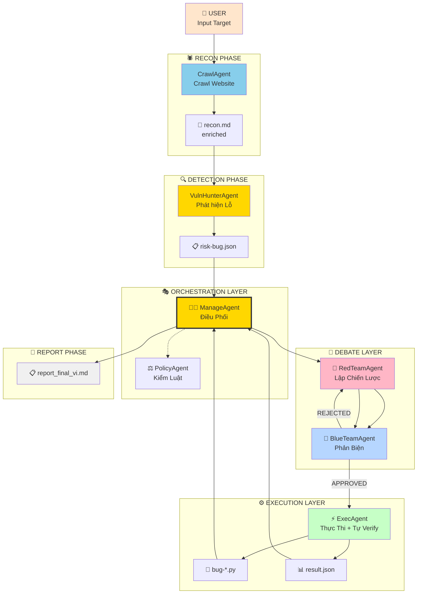

---

## 🔄 Luồng Chạy Chi Tiết (Main Pipeline)

```mermaid
graph LR
    A["🕷️ CRAWL<br/>anonymous +<br/>authenticated"] --> B["📄 RECON.MD<br/>enriched<br/>context"]
    
    B --> C["🎯 VULNHUNTER<br/>LLM: phát hiện<br/>BAC/BLF"]
    
    C --> D["📋 RISK-BUG.JSON<br/>candidate<br/>list"]
    
    D --> E["👨‍💼 MANAGER<br/>select bug"]
    
    E --> F["🔴 RED STRATEGY<br/>LLM: lập<br/>kế hoạch"]
    
    F --> G["📋 SHOT PLAN<br/>=== EXECUTION<br/>SHOT PLAN ==="]
    
    G --> H["🔵 BLUE REVIEW<br/>LLM: phản biện<br/>strategy"]
    
    H -->|APPROVED| I["⚡ EXEC<br/>gen Python<br/>self-verify"]
    
    H -->|REJECTED| F
    
    I --> J["📝 bug-*.py<br/>📊 output.txt<br/>📊 result.json"]
    
    J --> K["👨‍💼 MANAGER<br/>read FINAL/result"]
    
    K -->|❌ FAILED/PARTIAL| E
    
    K -->|✅ EXPLOITED| M["🎉 NEXT BUG"]
    
    M --> N["📄 REPORT<br/>report_final_vi.md"]
    
    style A fill:#87CEEB
    style B fill:#87CEEB
    style C fill:#FFD700
    style D fill:#FFD700
    style E fill:#FFD700,stroke:#333,stroke-width:3px
    style F fill:#FFB6C6
    style G fill:#FFB6C6
    style H fill:#B6D6FF
    style I fill:#C6FFC6
    style J fill:#C6FFC6
    style K fill:#FFB6C6
    style L fill:#C6FFC6
    style M fill:#90EE90
    style N fill:#F0F0F0
```

---

## 🎬 State Machine - Manager Decisions

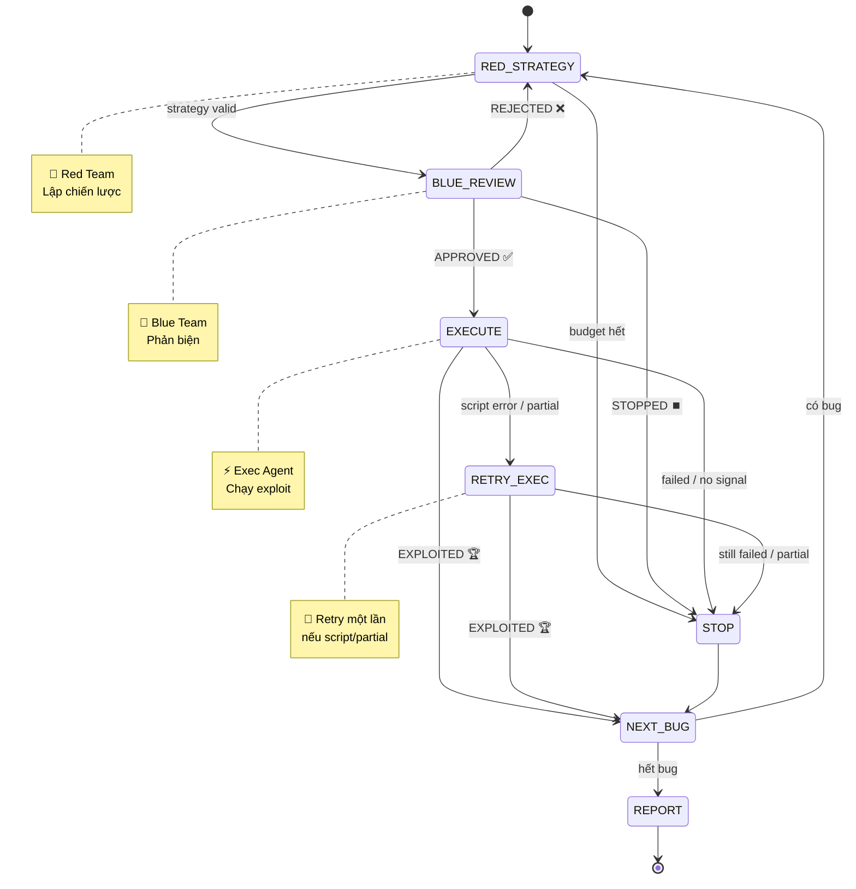

---

## 🔴 🔵 Red Team - Blue Team Debate

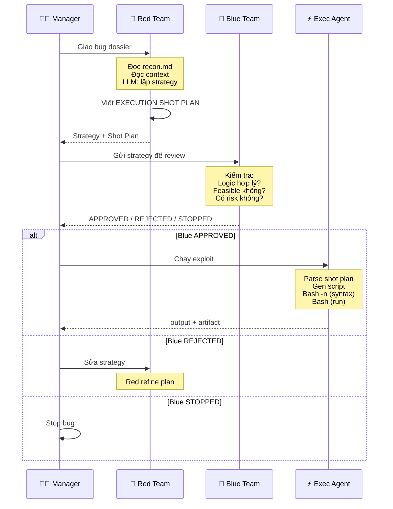

---

## ⚡ Execution Flow - One Exploit

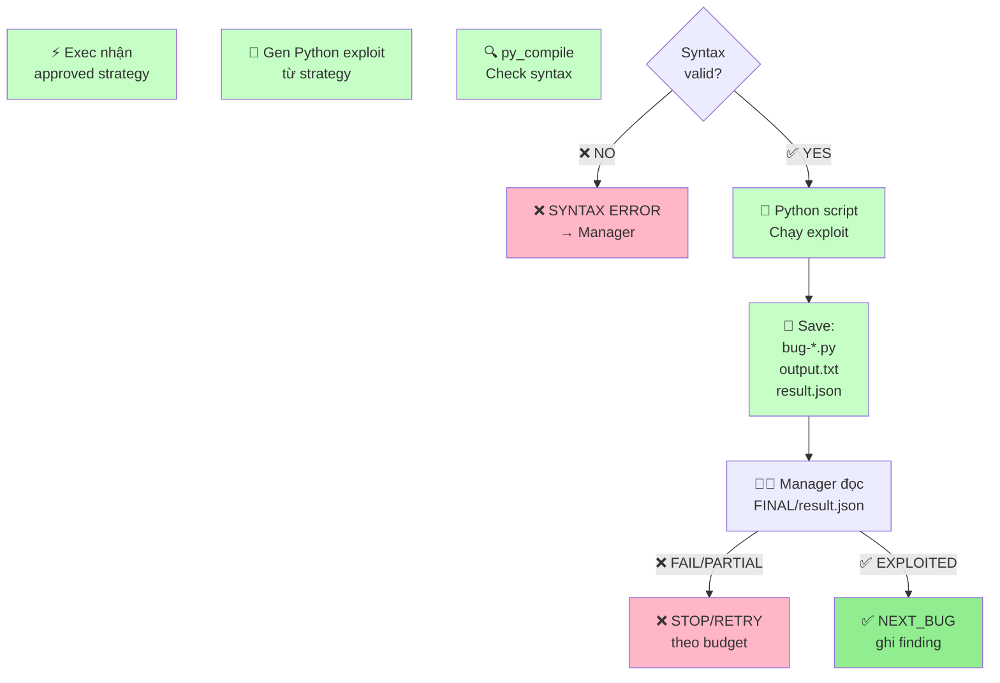

---

## 🛡️ Evidence Guard - Contradiction Checks

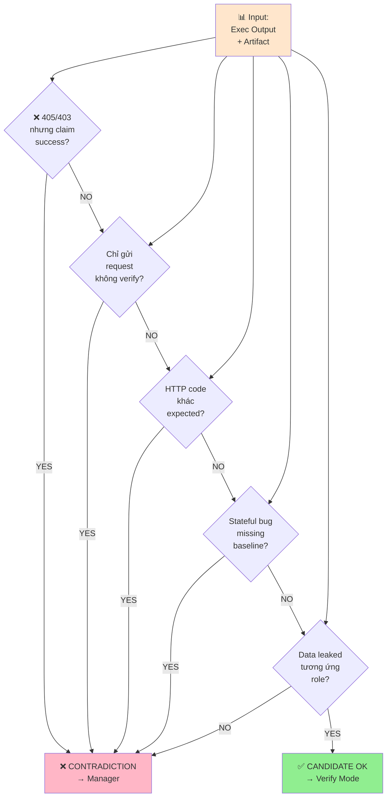

---

## 👨‍💼 Manager Decision - Minimum Proof

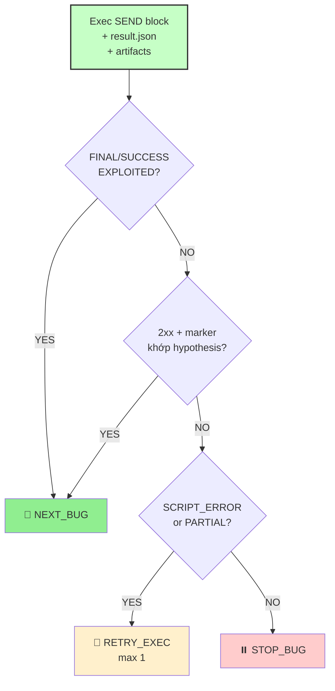

---

## 🔄 Per-Bug Collaboration Loop

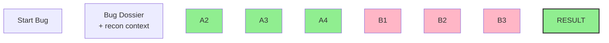

---

## 📁 Artifact Structure

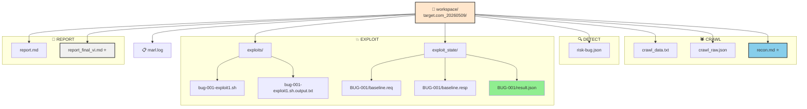

---

## 🎯 Bug Processing Workflow

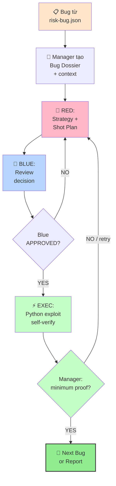

---

## 💾 Memory & Context Flow

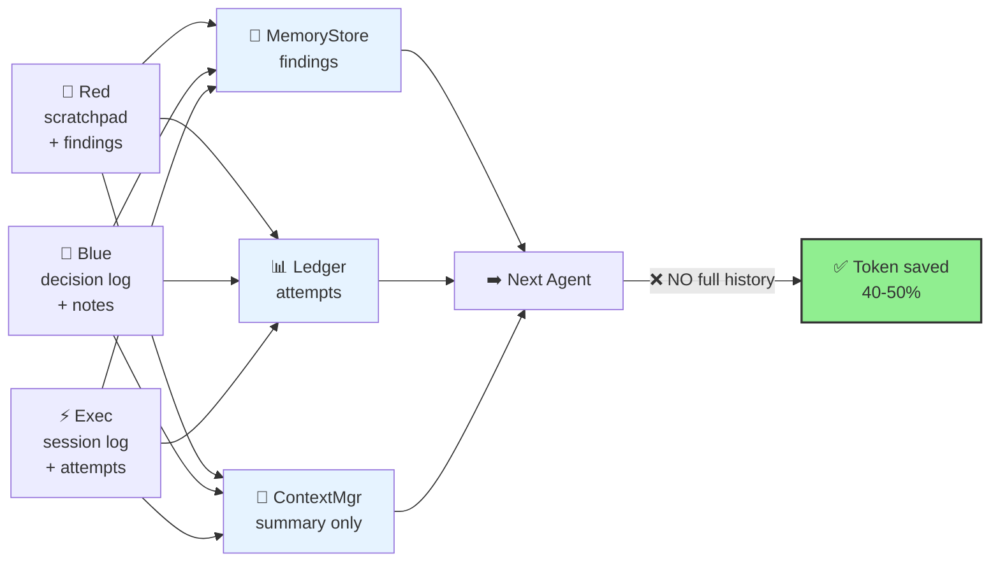

---

## 📊 Result JSON Schema

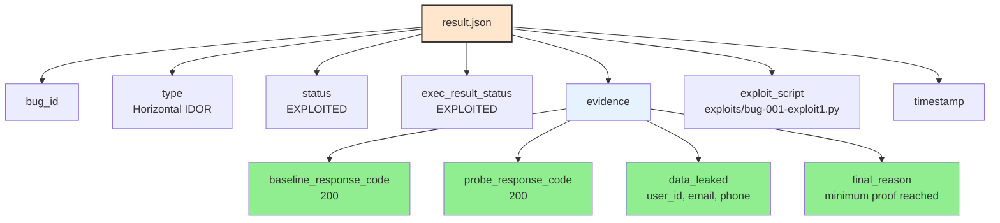

---

## 🎓 Presentation Flow

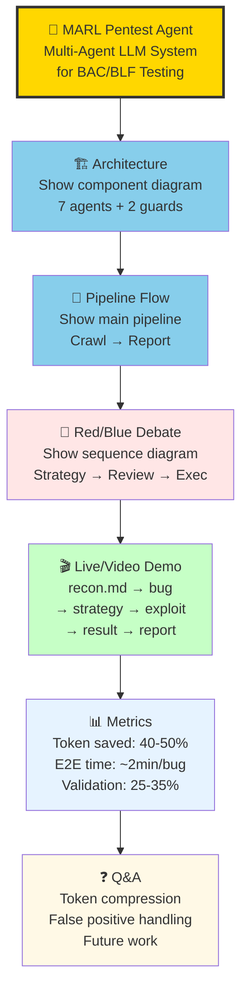

---

**Created**: 09/05/2026 | **Format**: Pure Mermaid Diagrams | **Purpose**: Visual Architecture Overview
