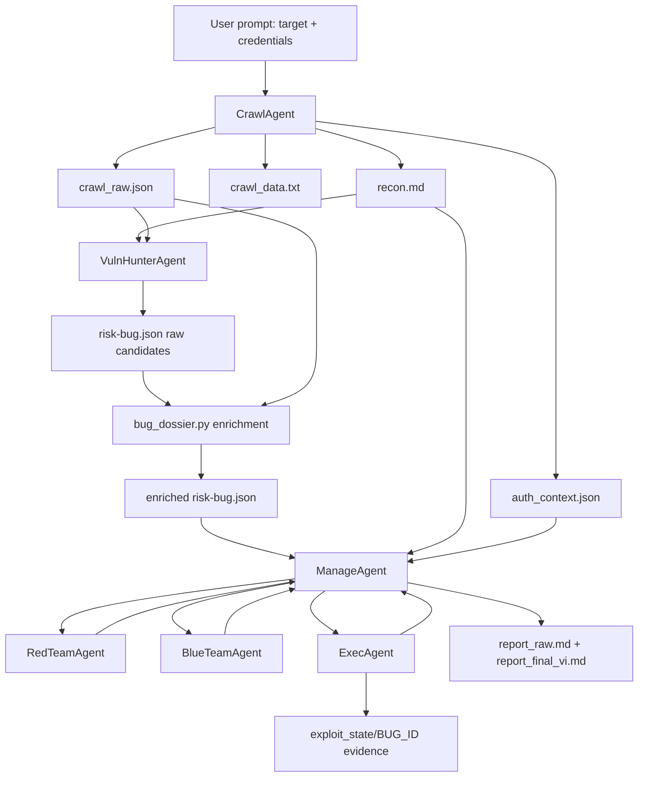

# MARL System Description

Tai lieu nay mo ta kien truc hien tai cua repo MARL, vai tro/"nang luong" cua tung agent, context di qua tung agent, va trang thai chay thuc te gan nhat dua tren workspace:

`workspace/localhost_20260531_122027`

Muc tieu cua file nay la lam dau vao cho mot agent khac doc, danh gia toan bo luong thuc thi, roi de xuat sua cac diem mu.

---

## 1. Tom Tat He Thong

MARL la pipeline multi-agent cho kiem thu BAC va BLF. Flow chinh nam trong `main.py`:

```text
User Prompt
  -> CrawlAgent
  -> VulnHunterAgent
  -> bug_dossier enrichment
  -> ManageAgent
      -> RedTeamAgent
      -> BlueTeamAgent
      -> ExecAgent
      -> Reporter
```

Muc tieu thiet ke:

- Crawl lay bang chung thuc te tu target.
- VulnHunter sinh danh sach bug candidates tu recon va raw crawl.
- ManageAgent dieu phoi tung bug.
- Red viet strategy khai thac rieng cho bug hien tai.
- Blue review strategy truoc khi cho Exec chay.
- Exec chay tool-loop/curl/browser/MCP de verify that.
- Manager ghi status va report.

Kien truc hien tai dang theo huong **surface-first + evidence-gated**, nhung van con cac diem mu ve BLF nhieu buoc, retargeting, va proof quality gate.

---

## 2. Artifact Va Context File

Moi run tao mot workspace:

```text
workspace/<host>_<timestamp>/
```

Cac file quan trong:

| File | Sinh boi | Dung boi | Vai tro |
|---|---|---|---|
| `marl.log` | Logger toan pipeline | Human/agent audit | Log day du tung phase, action, response, verdict. |
| `crawl_raw.json` | CrawlAgent | VulnHunter, bug_dossier, Exec, Manager | Raw artifact giau nhat: traffic, raw_endpoints, workflow_graph, auth sessions, discovery probes. |
| `crawl_data.txt` | CrawlAgent | Exec fallback, audit | Ban text raw crawl de doc nhanh. |
| `recon.md` | CrawlAgent deterministic renderer | VulnHunter, Manager, Exec preview | Recon da duoc cau truc hoa: endpoint inventory, discovery probes, graph, route families, endpoint dossiers. |
| `risk-bug.json` | VulnHunter + bug_dossier + Manager updates | Manager, Red, Blue, Exec | Queue bug candidates va status tung bug. |
| `auth_context.json` | Crawl/login flow | Manager, Exec | Auth material: cookies/session/token, verified status. |
| `exploit_state/<BUG_ID>/` | Exec | Report, audit | Evidence files cua tung bug: baseline/probe/verify responses. |
| `report_raw.md` | Manager | Human/agent audit | Report raw, co procedure va execution evidence. |
| `report_final_vi.md` / `report.md` | Manager | Human | Report final gon hon. |
| `memory/` | MemoryStore | Manager/ContextManager | Conversation full JSONL, summary, findings, task registry. |

---

## 3. Kien Truc Context Tong The



Context co 3 lop:

1. **Artifact context**: cac file that trong workspace.
2. **Model-facing context**: prompt ma tung LLM agent nhan.
3. **Runtime conversation context**: conversation list, memory summary, manager state, retry/failure notes.

---

## 4. Agent Energy Map

### 4.1 CrawlAgent

**File chinh:** `agents/crawl_agent.py`, `tools/crawler.py`

**Nang luong:** Thu thap su that tu target. Agent nay quyet dinh "do giau" cua toan bo pipeline. Neu Crawl nghieng ve route/signal ma thieu state transition, cac agent sau se doan nhieu.

**Input:**

- User prompt: URL, credentials neu co.
- Optional workspace reuse.
- Browser/session/cookies/token neu login duoc.

**Output:**

- `crawl_raw.json`
- `crawl_data.txt`
- `recon.md`
- `auth_context.json`

**Context no tao ra:**

- Anonymous crawl.
- Authenticated crawl.
- Active discovery probes.
- Observed endpoint inventory.
- Guided workflow graph.
- Guided auth/API hints.
- Structured route families.
- Endpoint dossiers.
- Candidate BAC/BLF signals.

**Diem manh hien tai:**

- Co crawl anonymous + authenticated.
- Co route discovery va graph.
- Co active discovery voi nhieu context: anonymous/auth/tampered.
- Co auth artifact cho Exec tai su dung.

**Diem mu hien tai:**

- BLF context van chua du sau: thieu successful baseline action, before/after state, multi-step chain.
- Active discovery co the tao nhieu signal rong tu HTML keyword.
- Status 200/302/405 dang duoc coi la route signal, nhung khong phai proof.
- Neu target la app co form phuc tap, crawler co the capture POST nhung thieu shape day du hoac thieu state verify.

---

### 4.2 VulnHunterAgent

**File chinh:** `agents/vuln_hunter_agent.py`

**Nang luong:** Bien recon thanh bug candidate. Day la "hypothesis generator". No khong verify bug, chi tao queue co can cu.

**Input:**

- Full `recon.md`.
- `crawl_raw.json` raw endpoints.
- BAC/BLF playbook.

**Output:**

- `risk-bug.json`.

**Context model-facing:**

- Full enriched recon.
- Huong dan chi tao candidate tu:
  - Observed Endpoint Inventory.
  - Guided Workflow Graph.
  - Guided Auth/API Hints.
  - Endpoint Dossiers.
  - Active Discovery Probes co route-like evidence.

**Post-processing deterministic:**

- Parse JSON response tu LLM.
- Normalize http_examples.
- Inject examples tu raw endpoints neu LLM thieu.
- Dedupe/rank candidate theo method + route family.
- Gioi han ACTION_DISCOVERY.
- Filter endpoint invalid: NaN/undefined/null.
- Filter metadata-only candidate.

**Fields quan trong trong moi bug:**

```json
{
  "id": "BUG-xxx",
  "category": "BAC|BLF",
  "pattern_id": "BAC-03|BLF-08|...",
  "candidate_type": "EVIDENCE_BACKED|ACTION_DISCOVERY",
  "evidence_status": "CRAWL_OBSERVED|ACTIVE_DISCOVERY|ACTION_DISCOVERY",
  "endpoint": "...",
  "method": "...",
  "hypothesis": "...",
  "exploit_approach": "...",
  "verify_method": "...",
  "http_examples": [],
  "request_params": [],
  "form_fields": [],
  "response_clues": [],
  "auth_required": true,
  "auth_credentials_needed": [],
  "confidence": "LOW|MEDIUM|HIGH"
}
```

**Diem manh hien tai:**

- Khong con phai chi doc prefix cua recon.
- Co them graph/evidence rules.
- Da biet dedupe va filter candidate thieu evidence.
- Da bot hardcode theo lab cu.

**Diem mu hien tai:**

- Van de sinh BLF tu signal nong neu Crawl chua co stateful proof.
- Candidate BAC co the sai ban chat neu route public/catalog bi gan IDOR.
- Candidate active_discovery co status 200 van de bi nang thanh risk cao neu response semantics khong du.

---

### 4.3 bug_dossier.py

**File chinh:** `shared/bug_dossier.py`

**Nang luong:** Lam giau `risk-bug.json` bang context deterministic. Day la cau noi giua Crawl/VulnHunter va Red/Blue/Exec.

**Input:**

- `risk-bug.json`
- `crawl_raw.json`

**Output:**

- Ghi lai `risk-bug.json` da enrich.

**Context no them vao bug:**

- Normalized `http_examples` co ca legacy fields:
  - `request`
  - `response_status`
  - `response_snippet`
  - `auth_session`
  - `session_label`
  - `provenance`
  - `why_relevant`
- `graph_context`:
  - summary nodes/edges/business_chain/api_hints.
  - related workflow edges.
  - business_chain gan endpoint.
- `evidence_rules`:
  - CRAWL_OBSERVED/ACTIVE_DISCOVERY/ACTION_DISCOVERY rules.
  - BAC-03 can ownership proof.
  - BLF can before/after/delta proof.
- `cookie_attack_surface`
- `attack_variants`
- `endpoint_function`
- `auth_observation`

**Diem mu hien tai:**

- Neu raw crawl khong capture du body/form/state, dossier khong the tu tao duoc BLF context.
- Related records co the keo endpoint gan nhau nhung khong cung bug, dan den retarget/pivot.

---

### 4.4 ManageAgent

**File chinh:** `agents/manage_agent.py`

**Nang luong:** Orchestrator/traffic controller. Chon bug, goi Red/Blue/Exec, doc verdict, retry, skip, save status, build report.

**Input:**

- `target_url`
- `recon_content`
- `risk-bug.json` enriched
- `auth_context.json`
- Shared conversation

**Output:**

- Updated `risk-bug.json`.
- `report_raw.md`
- `report_final_vi.md`
- Conversation/memory.

**Context model-facing cho Manager:**

- Manager prompt co:
  - target URL.
  - compact recon pack tu cac section quan trong:
    - `## Crawl Summary`
    - `## Evidence Rules`
    - `## Active Discovery Probes`
    - `## Guided Workflow Graph`
    - `## Guided Auth And API Hints`
    - `## Structured Route Families`
    - `## BAC / BLF Strategy From Observed Evidence`
  - bug queue summary.
  - compact playbook.
  - state_context runtime.

**Runtime responsibilities:**

- Sort/prioritize bug.
- Preflight auth/metadata checks.
- `DEBATE_RED -> DEBATE_BLUE -> EXECUTE_BUG -> NEXT_BUG`.
- Retry Red/Blue/Exec khi fail.
- Parse Exec result.
- Enforce proof quality gates mot phan.
- Persist memory.

**Diem manh hien tai:**

- Co per-bug pipeline ro.
- Co Blue gate truoc Exec.
- Co auth recovery/import session.
- Co proof gate cho IDOR/BLF/admin.

**Diem mu hien tai:**

- Co luc tin `SHOT_RESULT: EXPLOITED` qua manh du PoC generation bi reject hoac `verdict=UNKNOWN`.
- Neu Exec pivot sang endpoint khac, Manager van co the gan thanh current bug neu final reason noi EXPLOITED.
- Blue/Red approval co the khong du chong retargeting.
- Report "Validated Bugs" co the gom duplicate/root-cause overlap.

---

### 4.5 PolicyAgent

**File chinh:** `agents/policy_agent.py`

**Nang luong:** Guardrail routing. Kiem tra action Manager chon co hop le voi state khong.

**Input:**

- Proposed action.
- State context.
- Conversation.

**Output:**

- Validation verdict/suggested action.

**Diem mu hien tai:**

- Policy chu yeu kiem flow/routing, khong phai semantic proof verifier.
- Khong du suc phan biet finding retargeted neu Manager/Exec da ghi EXPLOITED.

---

### 4.6 RedTeamAgent

**File chinh:** `agents/red_team.py`

**Nang luong:** Attack strategist. No viet shot plan executable cho 1 bug hien tai.

**Input:**

- Current bug dossier tu `risk-bug.json`.
- `http_examples` cua bug.
- `graph_context` cua bug.
- `evidence_rules`.
- Auth evidence.
- Recent conversation.
- Manager failure/retry note neu co.

**Khong nhan full recon truc tiep** trong isolation model. Red chu yeu thay bug hien tai va evidence lien quan.

**Output:**

- Strategy text:
  - `CHIEN LUOC`
  - baseline/probe/verify.
  - `EXECUTION GUIDE`.
  - fallback.
  - success/partial condition.

**Context cut policy:**

- Recent conversation khoang 8-10 messages.
- Neu co memory store, co summary/scratchpad bo tro.

**Diem manh hien tai:**

- Co the viet plan ro cho BAC/cookie/IDOR.
- Da biet dung auth/session tu dossier.
- Co the doi approach sau Exec fail.

**Diem mu hien tai:**

- De voi BLF, Red hay chen gia dinh chua co evidence, vi du them `price` vao `/cart/add`.
- Co the pivot endpoint trong retry de tim bug that nhung lam lech current candidate.
- Neu evidence moi tu Exec noi "endpoint nay khong bi", Red doi luc van quay lai cung endpoint.

---

### 4.7 BlueTeamAgent

**File chinh:** `agents/blue_team.py`

**Nang luong:** Reviewer/gatekeeper. Blue khong khai thac, chi quyet approve/reject/stop strategy cua Red.

**Input:**

- Current bug dossier.
- HTTP examples.
- Auth evidence.
- Request params/form fields/response clues.
- Evidence rules.
- Graph context.
- Recent conversation.

**Output:**

- Verdict:
  - `APPROVED`
  - `REJECTED`
  - `STOPPED`
- Bat buoc echo `evidence_ref=...` de audit.

**Diem manh hien tai:**

- Da reject duoc BLF retry khi Red dua `price` ma dossier khong co evidence.
- Co the yeu cau minimum proof.

**Diem mu hien tai:**

- Van co luc approve `product/{id}` IDOR dua tren product diff, trong khi product co the public catalog.
- Co luc response co ca review dai + verdict, Manager parser co the doc nham neu co tu khoa reject/approve lan nhau.
- Chua du nghiem ve "strategy phai khop current endpoint"; vi du BUG-003/BUG-007 pivot sang `/profile/1`.

---

### 4.8 ExecAgent

**File chinh:** `agents/exec_agent.py`

**Nang luong:** Thuc thi that. Day la agent duy nhat duoc dung tool/curl/browser/MCP de tac dong target va tao evidence.

**Input:**

- Approved Red workflow.
- Conversation.
- Current bug dossier.
- Auth context/cookies/token.
- Files:
  - `auth_context.json`
  - `crawl_raw.json`
  - `crawl_data.txt`
  - `recon.md`
- Related raw examples.
- Evidence rules.

**Model-facing execution context gom:**

```text
RUN_DIR
AUTH_CONTEXT_FILE
CRAWL_RAW_FILE
CRAWL_DATA_FILE
RECON_FILE
AUTH_MECHANISM
COOKIE_HEADER / AUTH_BEARER_TOKEN
CURRENT BUG DOSSIER
CURRENT BUG HTTP EXAMPLES
CURRENT BUG GUIDED GRAPH CONTEXT
CURRENT BUG EVIDENCE RULES
RELATED CRAWL RAW EXAMPLES
RECON CONTEXT PREVIEW
```

**Output:**

- Tool-loop result text.
- Evidence files in `exploit_state/<BUG_ID>/`.
- Optional PoC script generation.
- Final markers:
  - `SHOT_RESULT: EXPLOITED|FAILED|PARTIAL`
  - `FINAL: EXPLOITED|FAILED|PARTIAL`
  - proof markers neu PoC validator yeu cau.

**Diem manh hien tai:**

- Thuc thi request that, co file evidence.
- Reuse authenticated cookies tu crawl.
- Co the self-verify status/body/state.

**Diem mu hien tai:**

- Co luc tool-loop tim bug that tren endpoint khac nhung khong report du chat la `RETARGETED/NEW_FINDING`.
- PoC validator reject nhung Manager van co the chap nhan SHOT_RESULT.
- MCP/fetch co the loi JSONRPC parse, sau do Exec fallback curl duoc nhung log bi nhieu traceback.
- BLF proof can before/action/after/delta, nhung Exec chua luon tao marker dung format.

---

### 4.9 MemoryStore va ContextManager

**Files:** `shared/memory_store.py`, `shared/context_manager.py`

**Nang luong:** Giu bo nho dai han va nen conversation khi dai.

**Input:**

- Conversation messages.
- Findings.
- Task registry.

**Output:**

- `memory/conversation_full.jsonl`
- `memory/conversation_summary.md`
- `memory/findings.json`
- scratchpad theo agent.

**Diem mu hien tai:**

- Khi conversation bi cat/nen, chi tiet proof/failure co the mat neu khong duoc ghi vao bug status/failure_reason.
- Red/Blue chi doc recent conversation, nen retry co the "cut context" neu Manager note khong du cu the.

---

## 5. Context Truyen Qua Tung Phase

### Phase 1: User -> CrawlAgent

Context:

- Target URL.
- Credentials trong user prompt neu co.
- Workspace mode fresh/reuse.

Output:

- Raw crawl, auth, recon.

Rui ro:

- Neu crawl khong thuc hien du business actions, BLF downstream yeu.

### Phase 2: CrawlAgent -> VulnHunter

Context:

- Full `recon.md`.
- `crawl_raw.json/raw_endpoints`.
- Playbook BAC/BLF.

Output:

- Candidate bugs.

Rui ro:

- Recon co signal nhieu nhung state it -> VulnHunter sinh candidate nong.

### Phase 3: VulnHunter -> bug_dossier -> Manager

Context:

- Bug raw tu LLM.
- Raw crawl records gan endpoint.
- Graph/business chain gan endpoint.
- Cookie surfaces.
- Evidence rules.

Output:

- Enriched bug queue.

Rui ro:

- Neu matching related endpoint qua rong, Exec/Red co the pivot sang endpoint khac.

### Phase 4: Manager -> Red

Context:

- Current bug only.
- HTTP examples toi da vai cai.
- Auth evidence.
- Request params/form fields.
- Response clues.
- Evidence rules.
- Graph context.
- Recent conversation/retry note.

Output:

- Strategy + execution guide.

Rui ro:

- Red khong thay full recon, nen neu bug dossier thieu, strategy co the "cụt".
- Retry note can that ro, neu khong Red lap lai loi.

### Phase 5: Manager -> Blue

Context:

- Current bug dossier.
- Red strategy trong conversation.
- Evidence rules.
- Graph context.
- Recent Exec/failure notes neu co.

Output:

- Approve/reject/stop.

Rui ro:

- Blue co the approve neu strategy nghe hop ly nhung evidence dossier chua du.
- Blue can bat buoc check: strategy co khop endpoint hien tai khong, co them params ngoai dossier khong.

### Phase 6: Manager -> Exec

Context:

- Approved strategy.
- Current bug dossier.
- Auth cookie/token.
- All relevant artifact file paths.
- Raw examples.
- Recon preview.

Output:

- Evidence files.
- Tool-loop summary.
- PoC generation result.
- Status cho Manager.

Rui ro:

- Exec co quyen doc rong hon Red/Blue nen co the tim bug khac.
- Neu tim bug khac, phai tach `RETARGETED/NEW_FINDING`; hien tai chua du chat.

### Phase 7: Exec -> Manager -> Report

Context:

- Exec output text.
- Saved evidence.
- Current bug status.

Output:

- `risk-bug.json` status.
- Final report.

Rui ro:

- Manager tin `SHOT_RESULT` qua manh.
- PoC validator reject nhung final van EXPLOITED.
- Duplicate/root cause co the tinh thanh nhieu finding.

---

## 6. Ket Qua Chay Hien Tai

Workspace audit:

`workspace/localhost_20260531_122027`

Tong quan:

- VulnHunter sinh 6 bug candidates.
- Report final ghi 3/6 EXPLOITED.
- 1 BLF candidate duy nhat khong verify duoc.

Candidate list:

| Bug | Endpoint | Pattern | Status | Nhan dinh |
|---|---|---|---|---|
| BUG-006 | `POST /cart/add` | BLF-08 race | NOT_EXPLOITED | BLF duy nhat, fail vi cart add baseline khong thanh cong; cart van empty sau 30 POST. |
| BUG-001 | `GET /admin` | BAC-02 cookie role tamper | EXPLOITED | Khai thac that: `role=user` bi redirect, `role=admin` vao admin duoc. |
| BUG-005 | `GET /admin/orders` | BAC-01 admin function | EXPLOITED | Khai thac that, nhung cung root cause cookie role tampering voi BUG-001. |
| BUG-003 | `GET /orders` | BAC-04 sensitive read | EXPLOITED | Co bug IDOR that nhung Exec pivot sang `/profile/1` va `/orders/1`; current endpoint `/orders` ban dau khong chung minh duoc. |
| BUG-002 | `GET /product/{id}` | BAC-03 IDOR | NOT_EXPLOITED | Product co ve public/catalog; proof quality gate chan do khong co ownership proof. |
| BUG-007 | `GET /transfer` | BAC-03 IDOR | NOT_EXPLOITED | `/transfer` khong chung minh IDOR; Exec/Red pivot sang profile IDOR nhung Blue/Manager cuoi cung khong validate. |

Ket luan tu run:

- He thong da khai thac duoc BAC vertical/cookie tampering that.
- He thong co tim ra IDOR that tren `/profile/{id}` va `/orders/{id}`, nhung do duoc tim bang pivot trong Exec, report gan vao BUG-003 chua sach.
- He thong chua phat hien/verify duoc BLF nhieu buoc nang.
- BLF fail chu yeu vi thieu stateful context: baseline action, form params day du, before/after state, order/payment/cart chain.

---

## 7. Diem Mu Can Agent Khac Tap Trung Danh Gia

### 7.1 BLF Context Richness

Cau hoi can kiem:

- Crawl co capture successful baseline state-changing action khong?
- Moi BLF candidate co:
  - state before?
  - action request body day du?
  - state after?
  - delta/invalid transition?
  - rollback/safe cleanup?
- Recon co phan biet keyword signal voi state proof khong?

### 7.2 Candidate Semantics

Cau hoi can kiem:

- `/product/{id}` co phai object co ownership khong, hay chi la public catalog?
- `GET /orders` khong co id ma bi gan IDOR co hop ly khong?
- Candidate BAC/BLF co nen tach `surface candidate` voi `confirmed hypothesis candidate` khong?

### 7.3 Retargeting

Cau hoi can kiem:

- Neu Exec tim bug tren endpoint khac current bug, Manager nen:
  - tao new finding?
  - cap nhat current bug endpoint?
  - hay reject current bug va queue bug moi?
- Report co nen ghi `RETARGETED_FINDING` rieng?

### 7.4 Proof Gate

Cau hoi can kiem:

- Neu PoC validator reject, Manager co duoc chap nhan `EXPLOITED` khong?
- `verdict=UNKNOWN` + `SHOT_RESULT=EXPLOITED` nen xu ly ra sao?
- BLF proof markers can bat buoc:
  - `PROOF_STATE_BEFORE`
  - `PROOF_ACTION_RESPONSE`
  - `PROOF_STATE_AFTER`
  - `PROOF_STATE_DELTA`

### 7.5 Blue Strictness

Cau hoi can kiem:

- Blue co reject strategy neu them param ngoai dossier khong?
- Blue co reject product public catalog IDOR khong?
- Blue co bat strategy khop current endpoint khong?

### 7.6 Manager Report Accuracy

Cau hoi can kiem:

- BUG-001 va BUG-005 co nen merge thanh 1 root cause?
- BUG-003 co nen doi endpoint thanh `/profile/{id}` va `/orders/{id}`?
- Report co can phan biet:
  - confirmed current candidate
  - retargeted confirmed finding
  - false positive
  - duplicate/root cause duplicate

---

## 8. De Xuat Huong Sua Tiep Theo

1. Nang crawl stage thanh hybrid graph crawler: deterministic BFS/action inventory + LLM-guided action planner + request-chain capture.
2. Dung model trong `.env` (`MARL_CRAWL_MODEL`, fallback `MARL_EXECUTOR_MODEL`) de chon mot so action/click dang thu, nhung chi qua JSON contract va safety policy.
3. Sau crawl phai co `workflow_graph`, `action_candidates`, `ai_decisions`, `request_chains`, `business_chain`, va `business_flows.json` de map nhieu quy trinh web khac nhau.
4. Them `finding_endpoint` va `current_bug_endpoint` rieng trong Exec output.
5. Bat Exec in `RETARGETED_FINDING: true/false`.
6. Neu retargeted true, Manager khong duoc set current bug `EXPLOITED`; thay vao do tao bug/finding moi.
7. Neu PoC validator reject, Manager chi duoc set `PARTIAL` hoac `PROOF_QUALITY_FAIL`, tru khi co override rule ro rang.
8. BLF candidate chi duoc `EVIDENCE_BACKED` khi co successful baseline state-changing request va before/after state.
9. Active discovery signal nen tach:
   - `route_exists`
   - `auth_diff`
   - `stateful_action_observed`
   - `ownership_object_observed`
   - `keyword_signal_only`
10. Red/Blue prompt nen bat buoc echo:
   - current endpoint,
   - allowed params,
   - observed request ref,
   - success proof marker.
11. Report nen group theo root cause.

---

## 9. Checklist Audit Nhanh Cho Agent Khac

Khi doc mot workspace moi, kiem theo thu tu:

1. Doc `risk-bug.json`: dem candidates, status, endpoint, evidence_status.
2. Doc `recon.md`: endpoint inventory + guided graph + route families.
3. Doc `crawl_raw.json`: raw_endpoints co bao nhieu state-changing requests?
4. Doc `exploit_state/<BUG_ID>/`: evidence co khop current endpoint khong?
5. Doc `marl.log`: Manager co retry/accept dung ly do khong?
6. Doc `report_raw.md`: finding co duplicate/root cause/pivot khong?
7. Ket luan rieng:
   - Confirmed current bug.
   - Confirmed but retargeted.
   - False positive.
   - Needs richer context.
